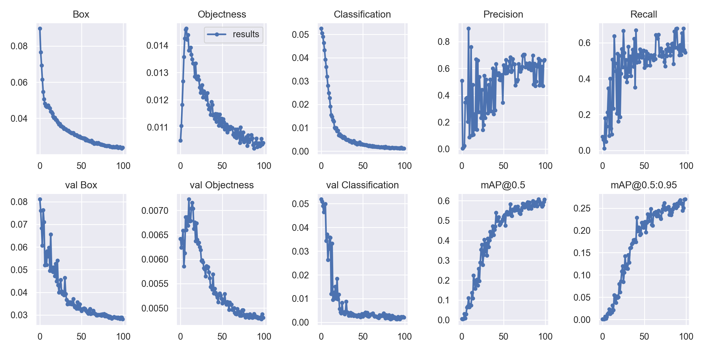
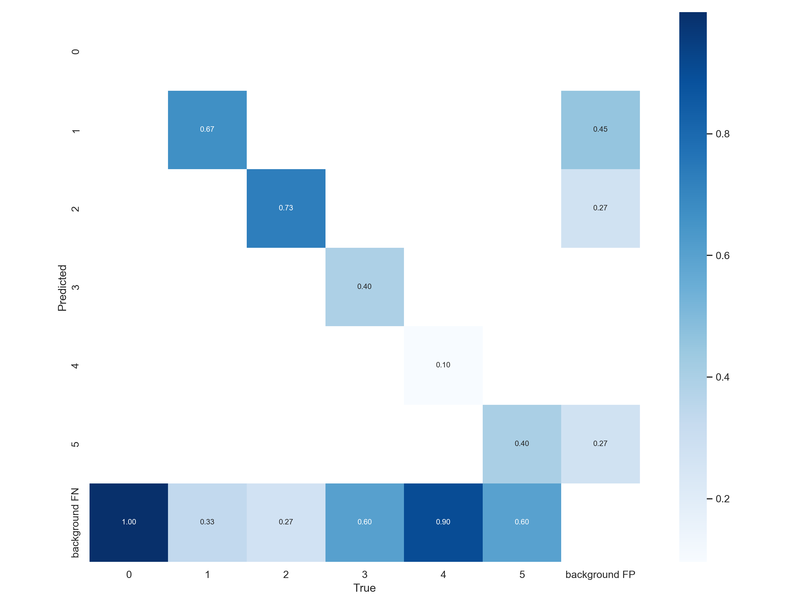
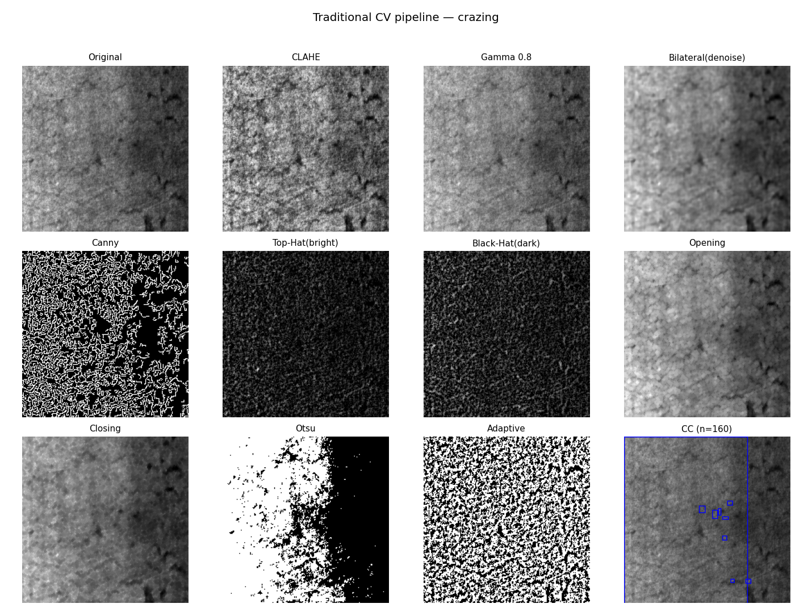
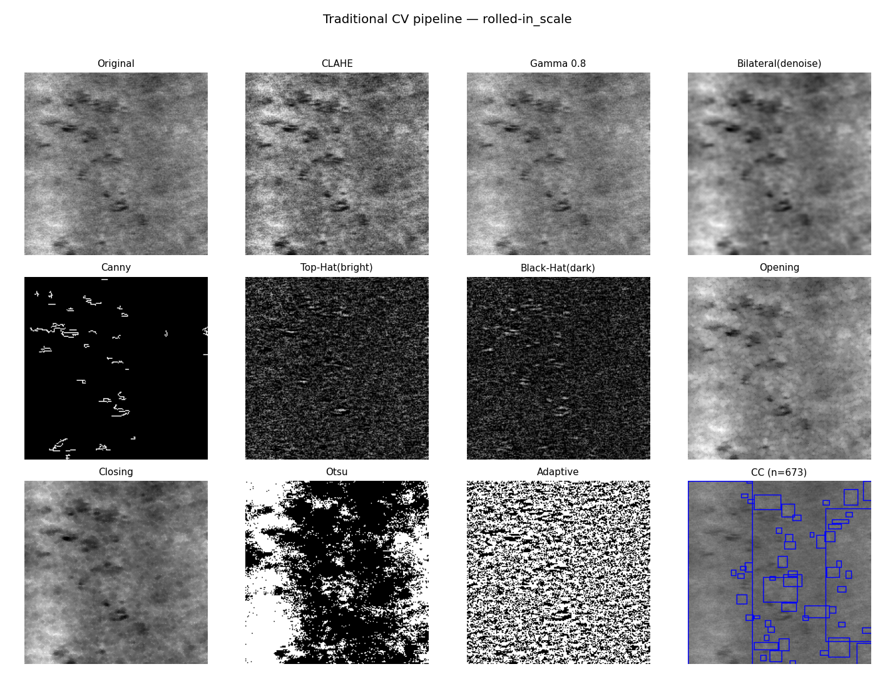
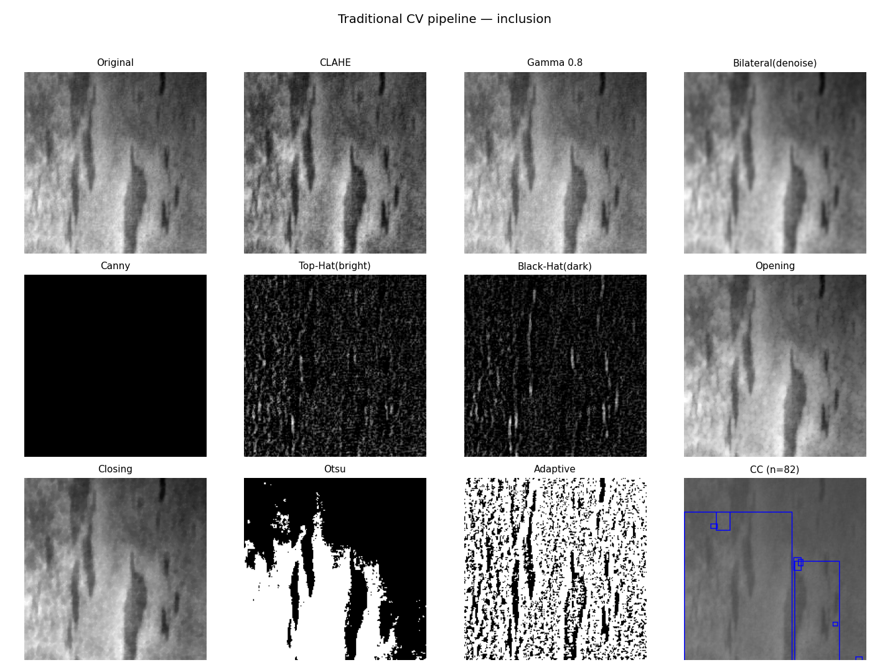
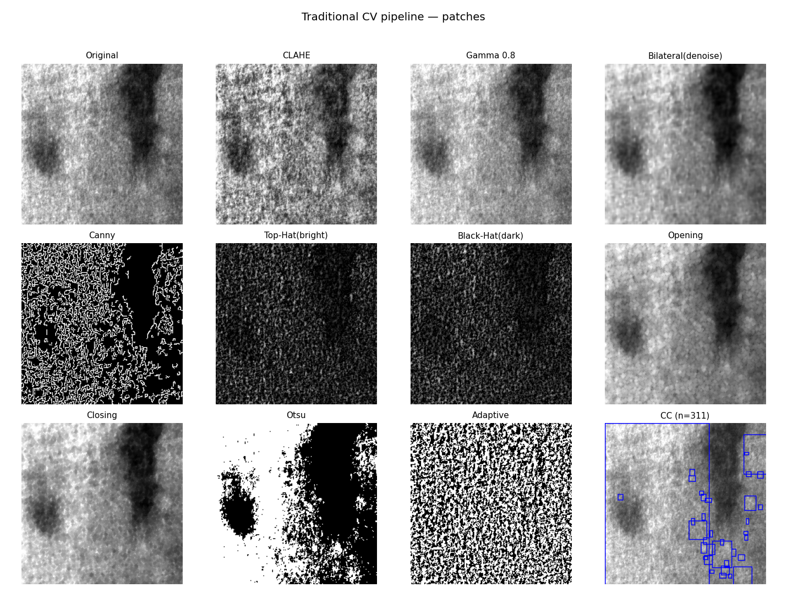
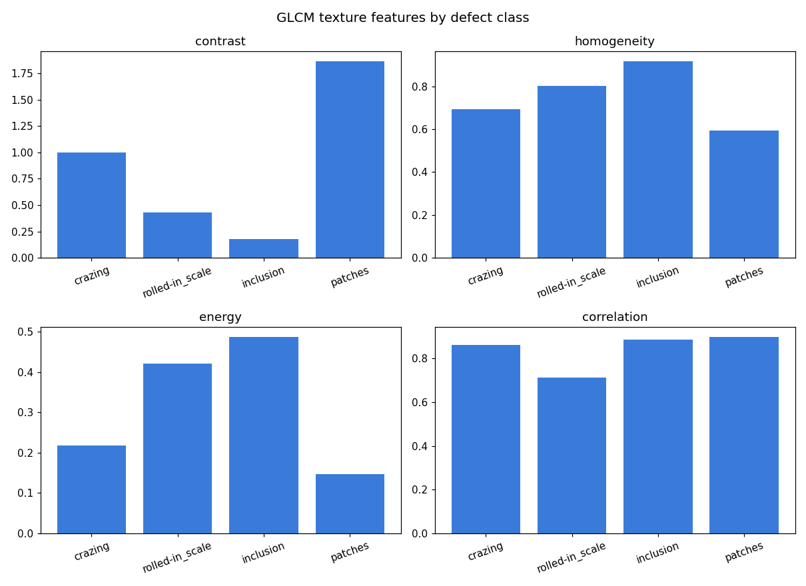
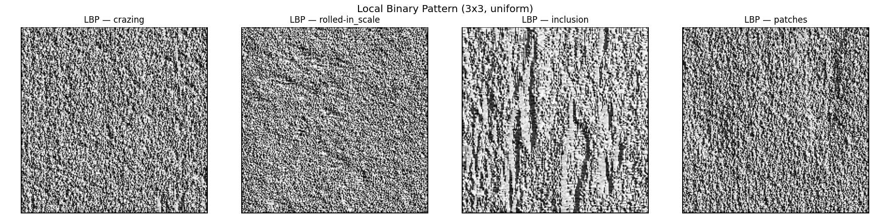
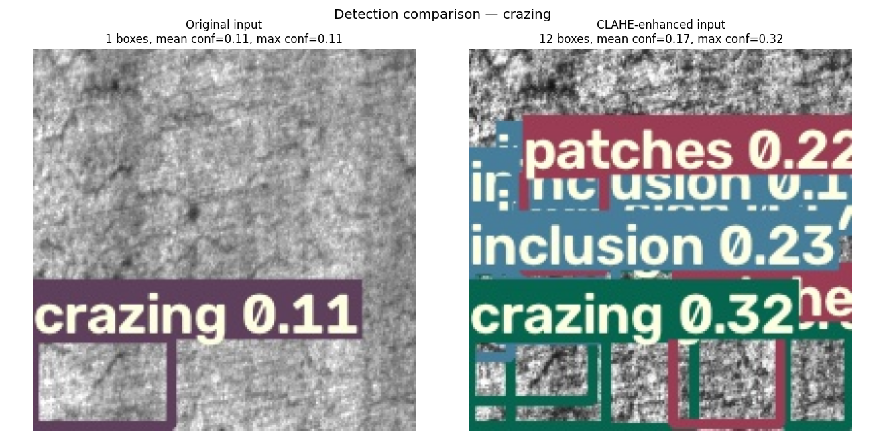
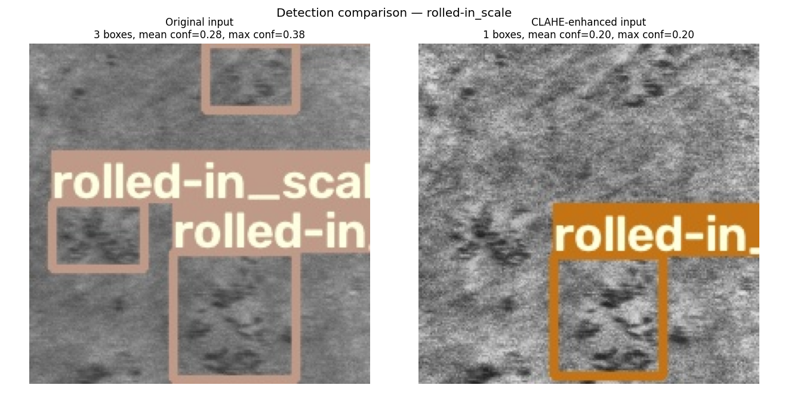

# 工业表面缺陷检测 (Industrial Surface Defect Detection)

> 基于 YOLOv5 的工业质检目标检测方案 —— 针对**微小、低对比度、多尺度**表面缺陷优化，  
> 覆盖数据转换 → 训练 → 评测 → **部署 (ONNX / TensorRT / REST API)** 的全流程。
>
> 本项目把一套已在比赛中验证过的 YOLOv5 改进，  
> 重新落地到**产线表面缺陷检测**这一工业场景，演示从算法到可部署质检服务的完整闭环。

---

## 1. 为什么做这个

在光电薄膜、金属板材、玻璃等制造产线上，表面缺陷（划痕、龟裂、夹杂、凹坑等）直接决定良率。  
传统人工目检存在三大痛点，正好对应本项目的算法设计：

| 工业痛点                  | 本项目对应解法                                   |
| --------------------- | ----------------------------------------- |
| **缺陷极小**（划痕宽度常 < 5px） | 增加 **P2/4 小目标检测头**，提升亚像素级小缺陷召回            |
| **低对比度 / 易漏检**        | neck 引入 **C3TR Transformer 自注意力**，强化上下文判别 |
| **缺陷尺度跨度大**（点状→面状）    | **P6 多尺度**配置，P3–P6 四尺度统一检测                |

---

## 2. 核心改进

在原生 YOLOv5s 基础上，本项目沉淀并验证了几组针对性改进，全部以独立 `*.yaml` 提供：

| 配置                                            | 关键改动                           | 适合场景                 |
| --------------------------------------------- | ------------------------------ | -------------------- |
| `models/defect_yolov5s_p2.yaml` ⭐推荐           | P2 小目标头 + 手工锚框 + autoanchor 微调 | **轻量、微小缺陷优先**，可边缘部署  |
| `models/defect_yolov5s6_tr.yaml`              | P6 多尺度 + C3TR Transformer 注意力  | 算力充裕的**服务器端**，低对比度缺陷 |
| `models/yolov5s-4l.yaml` / `yolov5s-4lm.yaml` | 4 尺度检测 + 多组锚框（比赛验证）            | 不同缺陷尺度分布的对照实验        |
| `models/yolov5s-3l.yaml` / `yolov5s6-5l.yaml` | 多尺度 / P6 大感受野基线                | Ablation 对照          |

---

## 3. 数据集

### 3.1 数据来源与声明

本项目使用公开基准 **NEU-DET**（东北大学 热轧钢带表面缺陷检测数据集）作为**算法验证与 demo 数据**。

- **原始出处**：Song Kechen 等，东北大学，热轧钢带表面缺陷检测公开数据集。
- **官方下载通道**：东北大学页面提供 Google Drive / 百度网盘（提取码 `pmqx`）。[`http://faculty.neu.edu.cn/songkechen/zh_CN/zdylm/263270`](http://faculty.neu.edu.cn/songkechen/zh_CN/zdylm/263270)
- **本仓库获取方式**：使用 GitHub 镜像仓库 `allanwong/NEU-DET-Steel-Surface-Defect-Detection`。
- **数据完整性**：镜像把 `IMAGES`（1770 张）与 `Validation_Images`（30 张）合并，共 **1800 张 200×200 灰度图**，对应 **1800 个 PASCAL VOC XML 标注**。

> ⚠️ **诚实声明**：NEU-DET 是公开 benchmark。本仓库用它验证训练/评测管线、演示缺陷检测能力，**并非独家工业数据**。但 `tools/prepare_neu_det.py` 与 `data/defect_neu.yaml` 可直接替换为自有产线数据（偏振片、光学膜、玻璃等），方法可迁移。

### 3.2 类别定义

| id | 类别                | 中文    | 典型形态 |
| -- | ----------------- | ----- | ---- |
| 0  | `crazing`         | 龟裂    | 网状细纹 |
| 1  | `inclusion`       | 夹杂    | 异色点块 |
| 2  | `patches`         | 斑块    | 成片色差 |
| 3  | `pitted_surface`  | 凹坑表面  | 点状凹陷 |
| 4  | `rolled-in_scale` | 轧入氧化皮 | 条带状  |
| 5  | `scratches`       | 划痕    | 线状痕迹 |

> 方法学可直接迁移到**偏振片 / 光学膜 / 玻璃**等产线的自有缺陷数据：只需按相同目录结构准备标注，无需改代码。

### 3.3 数据准备（一行命令完成格式转换 + 切分）

不同来源的 NEU-DET 标注格式不一，本仓库提供 `tools/prepare_neu_det.py` 统一转换成 YOLOv5 格式：

```bash
# VOC-XML 版本
python tools/prepare_neu_det.py \
    --src datasets/raw/images \
    --ann datasets/raw/annotations \
    --out datasets/NEU-DET --format voc

# 东北大学原生 txt 版本
python tools/prepare_neu_det.py \
    --src datasets/raw/images \
    --ann datasets/raw/annotations \
    --out datasets/NEU-DET --format neu
```

转换后生成（与 `data/defect_neu.yaml` 自动对齐）：

```
datasets/NEU-DET/
  ├── images/{train,val,test}/*.jpg
  └── labels/{train,val,test}/*.txt
```

> ✅ **本仓库数据集已就绪（本地）**：已拉取 NEU-DET 镜像并跑通转换脚本，当前 `datasets/NEU-DET/` 已含 **1800** 张图（train 1441 / val 179 / test 180，另有 2 张无标注的 Workflow 演示图被自动跳过），可直接跳到 4.2 训练。原始压缩包与解包目录保留在 `datasets/NEU-DET-raw/`（已被 `.gitignore` 忽略，不入库）。

---

## 4. 快速开始

### 4.1 安装

```bash
pip install -r requirements.txt
```

### 4.2 训练

本项目实测命令（GTX 1650，4G 显存）：

```bash
python train.py \
    --data data/defect_neu.yaml \
    --cfg  models/defect_yolov5s_p2.yaml \
    --weights yolov5s.pt \
    --img 640 --batch 16 --epochs 100 --device 0
```

- `--weights ''` 表示从头训练；迁移学习推荐 `yolov5s.pt`（本仓库实测）。
- `--cfg` 可换成 `defect_yolov5s6_tr.yaml`（Transformer 多尺度版）。
- 训练曲线、混淆矩阵、PR 曲线自动存到 `runs/train/exp4/`（实验号会递增）。

### 4.3 验证（mAP）

```bash
python test.py \
    --data data/defect_neu.yaml \
    --weights runs/train/exp4/weights/best.pt --img 640
```

### 4.4 推理

```bash
python detect.py \
    --source datasets/NEU-DET/images/test \
    --weights runs/train/exp4/weights/best.pt \
    --conf 0.25 --save-conf
```

> 本仓库最近一次推理结果保存在 `runs/detect/exp6/`。

### 4.5 环境冒烟测试（免训练，先验证管线通不通）

不想先下载数据集/训练，只想确认 `torch + CUDA + detect` 管线能跑？用仓库自带的一张合成「钢板表面缺陷」演示图即可：

```bash
python detect.py \
    --source data/images/sample_defect.jpg \
    --weights yolov5s.pt \      # 官方 COCO 预训练权重，会自动下载
    --conf 0.25
```

> 说明：`yolov5s.pt` 是在 COCO（80 类日常物体）上预训练的，**不是**缺陷模型，所以在这张合成缺陷图上大概率检不出"缺陷"类别——这一步的目的只是验证「权重能下载、CUDA 能推理、结果能写出」。要真正检测缺陷，请走 4.2→4.4（训 NEU-DET + 用 defect 权重推理）。  
> `data/images/sample_defect.jpg` 是本地 PIL 生成的合成图，**非真实 NEU-DET 样本**，仅用于跑通管线。

---

## 5. 部署

YOLOv5 原生支持多后端导出，本项目据此给出产线落地路径：

```bash
# 1) 导出 ONNX（跨平台、可被 OpenCV/TensorRT/ONNXRuntime 加载）
python export.py --weights runs/train/exp4/weights/best.pt --include onnx

# 2) 导出 TensorRT engine（GPU 边缘设备，毫秒级推理）
python export.py --weights runs/train/exp4/weights/best.pt --include engine --device 0

# 3) 封装为 REST 推理服务（utils/flask_rest_api）
#    把模型包成 HTTP 接口，对接 MES / 上位机做实时质检
```

| 部署形态    | 工具                  | 典型设备           |
| ------- | ------------------- | -------------- |
| 服务端批量质检 | ONNXRuntime / Flask | 工控机 / 服务器      |
| 边缘实时推理  | TensorRT            | Jetson / 产线工控盒 |
| 可视化界面   | detect.py + OpenCV  | 质检工位           |

---

## 6. 评测指标

### 6.0 实测条件

| 项目    | 值                                                                                                                                                   |
| ----- | --------------------------------------------------------------------------------------------------------------------------------------------------- |
| 模型    | `models/defect_yolov5s_p2.yaml`                                                                                                                     |
| 预训练权重 | `yolov5s.pt`（COCO 迁移）                                                                                                                               |
| 训练命令  | `python train.py --data data/defect_neu.yaml --cfg models/defect_yolov5s_p2.yaml --weights yolov5s.pt --img 640 --batch 16 --epochs 100 --device 0` |
| 验证集   | NEU-DET val，179 张，404 个标签                                                                                                                           |
| 设备    | NVIDIA GeForce GTX 1650，4G 显存                                                                                                                       |
| 训练时长  | 9.8 小时                                                                                                                                              |
| 显存峰值  | 5.14 GB                                                                                                                                             |
| 产出权重  | `runs/train/exp4/weights/best.pt`（15.1 MB）                                                                                                          |

### 6.1 总体指标

| 模型                 | mAP@0.5   | mAP@0.5:0.95 | 参数量   | 训练设备 / 时长       |
| ------------------ | --------- | ------------ | ----- | --------------- |
| YOLOv5s (baseline) | —         | —            | 7.3M  | —               |
| **+ P2 小目标头** ⭐    | **0.606** | **0.270**    | 7.22M | GTX 1650 / 9.8h |
| + Transformer (P6) | 待测        | 待测           | ~12M  | —               |

### 6.2 各类别 P/R 与 mAP（验证集）

| 类别 (id)               | 中文    | Labels | P      | R      | mAP@0.5 | mAP@0.5:.95 |
| --------------------- | ----- | ------ | ------ | ------ | ------- | ----------- |
| `patches` (2)         | 斑块    | 70     | 0.742  | 0.865  | 0.861   | 0.443       |
| `inclusion` (1)       | 夹杂    | 96     | 0.617  | 0.802  | 0.756   | 0.342       |
| `scratches` (5)       | 划痕    | 60     | 0.734  | 0.689  | 0.740   | 0.324       |
| `pitted_surface` (3)  | 凹坑表面  | 48     | 0.500  | 0.687  | 0.686   | 0.340       |
| `rolled-in_scale` (4) | 轧入氧化皮 | 52     | 0.396  | 0.227  | 0.335   | 0.094       |
| `crazing` (0)         | 龟裂    | 78     | 1.000* | 0.000* | 0.261   | 0.071       |

> \* `crazing` 的 P=1.0 / R≈0 表示模型在当前置信阈值下几乎不预测该类，是典型的**严重漏检**，而非误检。整体 P=0.665 / R=0.545。

### 6.3 训练曲线与收敛分析



box / obj / cls 三 loss 在前 30 epoch 快速下降，mAP@0.5 在 60 epoch 后趋于稳定，最终验证集 **mAP@0.5=0.606 / mAP@0.5:.95=0.270**，无明显过拟合。

### 6.4 混淆矩阵



对角线外较亮的块主要出现在 `crazing` / `scratches` / `rolled-in_scale` 之间，说明**条状/网状缺陷在特征空间上存在重叠**，是后续引入 Transformer 上下文与多尺度要重点解决的问题。

### 6.5 检测样例

| patches（命中，mAP 0.861） | inclusion（命中，mAP 0.756） |
| --------------------- | ----------------------- |
| patches               | inclusion               |

| crazing（弱项，mAP 0.261） | rolled-in_scale（弱项，mAP 0.334） |
| --------------------- | ----------------------------- |
| crazing               | rolled-in_scale               |

### 6.6 关键洞察

1. **crazing（龟裂）R≈0**：模型几乎不触发该类。根因是网状细纹极小、与 scratches/patches 纹理接近，需要在更高分辨率 + 更难例聚焦上下功夫。
2. **rolled-in_scale（轧入氧化皮）P/R 双低**：条带状、低对比度，既漏检也易与背景混淆，需要上下文建模和对比度增强。
3. **patches / inclusion / scratches**：已具备较高精度与召回，是现版本可以直接展示的优势。

---

## 7. 传统图像处理与特征增强

> 使用「图像处理基础：图像滤波、边缘检测、形态学处理」以及「去噪、增强、分割、特征提取」等核心算法能力。本节在同一套 NEU-DET 数据上演示这些传统 CV 操作，说明它们如何与深度学习目标检测互补，并提供可复现脚本。

### 7.1 为什么深度学习还需要传统图像处理

工业表面图像常见问题：

- **光照不均 / 背景纹理强** → 需要局部对比度增强（CLAHE）、伽马校正
- **缺陷极小、信噪比低** → 需要保边去噪（双边滤波）
- **缺陷形态差异大** → 边缘、形态学、纹理特征可作为先验

传统 CV 不做为最终检测器，而是三种角色：

1. **数据增强**：在训练阶段加入 CLAHE / 形态学扰动，提升难例类（`crazing`、`rolled-in_scale`）召回。
2. **推理预处理**（可选模块）：提升低对比度输入的可辨识度。
3. **特征工程基线**：用 GLCM / LBP 等纹理特征与深度特征做对照，验证模型是否学到了本质差异。

### 7.2 预处理管线（`tools/preprocess_demo.py`）

`tools/preprocess_demo.py` 对每类缺陷做 12 步处理，输出到 `docs/figures/preprocessing/{class}_pipeline.png`：

| 分组    | 操作                   | 对应 JD 关键词 | 目的                           |
| ----- | -------------------- | --------- | ---------------------------- |
| 去噪/增强 | CLAHE                | 增强        | 局部对比度均衡，缓解低对比度               |
| 去噪/增强 | Gamma 0.8            | 增强        | 提亮中灰，突出暗缺陷                   |
| 去噪/增强 | Bilateral Filter     | 去噪 / 图像滤波 | 保边去噪，不糊裂纹                    |
| 边缘/形态 | Canny                | 边缘检测      | 提取缺陷轮廓                       |
| 边缘/形态 | Top-Hat              | 形态学处理     | 增强亮目标（`inclusion`/`patches`） |
| 边缘/形态 | Black-Hat            | 形态学处理     | 增强暗目标（`scratches`/`crazing`） |
| 边缘/形态 | Opening / Closing    | 形态学处理     | 去噪 / 连接断裂裂纹                  |
| 分割    | Otsu / Adaptive      | 分割        | 二值化缺陷掩码                      |
| 分割    | Connected Components | 分割        | 连通域分析与定位                     |

### 7.3 各类别管线对比

**crazing（龟裂，mAP 最低）**



- **CLAHE / Gamma**：网状细纹对比度提升，裂纹可见性增强。
- **Canny**：大量细碎边缘反映 crazing 与钢材纹理高度混杂，说明仅靠边缘检测难以区分缺陷与背景。
- **Otsu / Adaptive**：全局阈值基本失效（左侧半图全白），印证了光照不均下传统阈值分割的脆弱性。
- **CC(n=160)**：连通域碎片化严重，说明简单形态学后处理也无法直接得到完整缺陷区域。

**rolled-in_scale（轧入氧化皮，低对比度条带）**



- **CLAHE**：条带状缺陷从灰蒙蒙背景中浮现，但背景纹理也被同步放大。
- **Canny**：能勾勒出主要缺陷区域，但仍混入大量背景边缘。
- **Otsu / Adaptive**：同样被复杂背景淹没，无法得到干净掩码。

**inclusion（夹杂，亮目标）**



- **CLAHE / Top-Hat**：亮目标被显著增强，形态学操作效果明显优于低对比度类。
- **Otsu**：目标与背景亮度差异大，二值化相对干净。

**patches（斑块，大面积色差）**



- **Black-Hat**：对暗斑区域增强明显。
- **Closing**：可把离散斑块连成片状区域。

### 7.4 纹理特征（GLCM + LBP）

**GLCM 纹理特征**



对每类缺陷计算灰度共生矩阵（GLCM），提取对比度、同质性、能量、相关度四项指标（纯 numpy 实现）：

- `patches` 对比度最高（纹理差异大、边界明显）
- `inclusion` 能量最高（区域内部相对均匀）
- `rolled-in_scale` 同质性较高（条带纹理重复），与深度学习低 mAP 形成对照：传统纹理特征并不能直接解决低对比度问题
- `crazing` 相关度高，说明裂纹方向性强、纹理自相关明显

**LBP 局部二值模式**



3×3 uniform LBP 可视化显示不同缺陷的局部纹理模式差异。LBP 可作为轻量纹理描述子，与深度特征互补。

### 7.5 与 YOLOv5 推理结合：CLAHE 增强前后对比

为验证传统增强在深度学习推理中的实际效果，用同一 `best.pt` 对原始图和 CLAHE 增强图分别跑 `detect.py`（`--conf-thres 0.10`，让所有候选框可见）。

**crazing**



- 原图：仅 1 个低置信 `crazing` 框（conf=0.11）
- CLAHE：最高置信度提升到 0.32，但引入多个 `inclusion` / `patches` 误检
- **结论**：推理期硬加 CLAHE 会提高响应，但也会放大噪声导致误检；更可靠的做法是把它作为**训练数据增强**，让模型在增强分布上学习。

**rolled-in_scale**



- 原图：3 个低置信框（mean conf=0.28 / max=0.38）
- CLAHE：1 个框（conf=0.20），虽然数量减少，但框更集中在真实条带区域
- **结论**：CLAHE 对 rolled-in_scale 的增强效果不稳定，高 clipLimit 会同步放大背景纹理，需要与训练协同。

> 综合结论：传统预处理能显著改变缺陷/背景的可分性，但**不应仅在推理时硬加**，而应与模型训练协同设计（如作为数据增强或联合调优模块）。

### 7.6 可复现脚本

```bash
# 生成全部传统 CV 对比图（含 GLCM/LBP）
python tools/preprocess_demo.py

# 生成 CLAHE 增强前后 detect.py 对比图
python tools/preprocess_detect_compare.py
```

输出目录：`docs/figures/preprocessing/`

---

## 8. 优化迭代计划（待跑）

下一版目标是提升 `crazing` 与 `rolled-in_scale` 的召回，同时保持整体 mAP。已准备针对性超参文件 `data/hyp.opt.yaml`：

- `fl_gamma: 2.0`：Focal Loss，聚焦难例；
- `hsv_v: 0.6`：增强亮度/对比度扰动；
- `mosaic: 0.5`：降低 mosaic 对小目标的过度压缩。

```bash
# 1. P2 优化版训练（更高分辨率 + 针对性超参）
python train.py \
    --data data/defect_neu.yaml \
    --cfg models/defect_yolov5s_p2.yaml \
    --weights yolov5s.pt \
    --img 800 --batch 8 --epochs 150 --device 0 \
    --hyp data/hyp.opt.yaml

# 2. 验证并回填下表
python test.py \
    --data data/defect_neu.yaml \
    --weights runs/train/exp/weights/best.pt --img 800
```

> 若 GTX 1650 在 `--img 800 --batch 8` 下 OOM，可降到 `--img 736 --batch 8` 或 `--img 800 --batch 4`。也可同时跑 `defect_yolov5s6_tr.yaml`（Transformer 多尺度版）做第二组对照。

**Ablation 对比表（待回填）：**

| 模型              | img | 关键优化                          | mAP@0.5 | mAP@0.5:.95 | crazing mAP | rolled-in_scale mAP |
| --------------- | --- | ----------------------------- | ------- | ----------- | ----------- | ------------------- |
| P2 baseline（已跑） | 640 | COCO 迁移 + autoanchor          | 0.606   | 0.270       | 0.261       | 0.335               |
| P2 + opt（待跑）    | 800 | Focal Loss + 对比度增强 + 降 mosaic | —       | —           | —           | —                   |

---

## 9. 目录结构

```
industrial-defect-detection/
├── data/
│   ├── defect_neu.yaml          # 数据集配置 (NEU-DET 6 类)
│   ├── hyp.scratch.yaml         # 默认超参
│   └── hyp.opt.yaml             # 针对难例类的优化超参
├── models/
│   ├── defect_yolov5s_p2.yaml   # ⭐ 推荐: P2 小目标头
│   ├── defect_yolov5s6_tr.yaml  # Transformer 多尺度版
│   └── yolov5s-3l/4l/4lm/...    # 比赛验证的多尺度配置
├── tools/
│   ├── prepare_neu_det.py            # NEU-DET 标注 → YOLO 格式转换 + 切分
│   ├── preprocess_demo.py              # 传统 CV 预处理/增强/分割/特征提取对比
│   └── preprocess_detect_compare.py  # CLAHE 增强前后 detect.py 推理对比
├── docs/
│   └── figures/                 # README 配图（训练曲线、混淆矩阵、检测样例、传统 CV 对比图）
├── train.py / test.py / detect.py / export.py   # YOLOv5 训练/评测/推理/导出
├── utils/                       # 数据加载 / 损失 / 指标 / Flask 推理服务
├── weights/                     # 训练权重 (gitkeep)
├── datasets/                    # 数据集 (gitkeep, 不入库)
└── runs/                        # 训练 / 推理输出 (gitkeep)
```

---

## 10. 技能匹配

| 技能要求（典型）         | 本项目提供的证据                                            |
| ---------------- | --------------------------------------------------- |
| 计算机视觉 / 目标检测落地   | YOLOv5 工业缺陷检测全流程实现                                  |
| 算法优化（小目标 / 低对比度） | P2 小目标头 + C3TR Transformer 注意力                      |
| 模型训练与调优          | 多组 cfg 对照实验、autoanchor、数据增强                         |
| **模型部署**         | ONNX / TensorRT 导出 + Flask REST 服务                  |
| 图像滤波 / 去噪 / 增强   | CLAHE、Bilateral、Gamma（见第 7 节）                       |
| 边缘检测 / 形态学处理     | Canny、Top-Hat / Black-Hat、开闭运算（见第 7 节）              |
| 图像分割             | Otsu / 自适应阈值、连通域分析（见第 7 节）                          |
| 特征提取             | GLCM、LBP 纹理特征（见第 7 节，纯 numpy 实现）                    |
| 工业数据工程化          | 标注格式转换脚本、train/val/test 自动切分                        |
| 工程规范             | `tools/ci_check.py` 配置/结构自检脚本（本地可跑）、requirements 锁定 |
| 业务落地思维           | 从产线痛点反推算法设计（见第 1 节）                                 |

> 说明：本仓库覆盖**视觉检测 + 传统图像处理 + 部署**三个方向。本项目的定位是用一个**完整、可复现、能跑通部署**的CV 案例，证明「把模型真正落到产线」的端到端能力。

---

## 11. License

代码基于 Ultralytics YOLOv5（GPL-3.0）裁剪改造；本仓库新增的配置文件、转换脚本与文档以 **MIT** 发布，详见 `LICENSE`。
